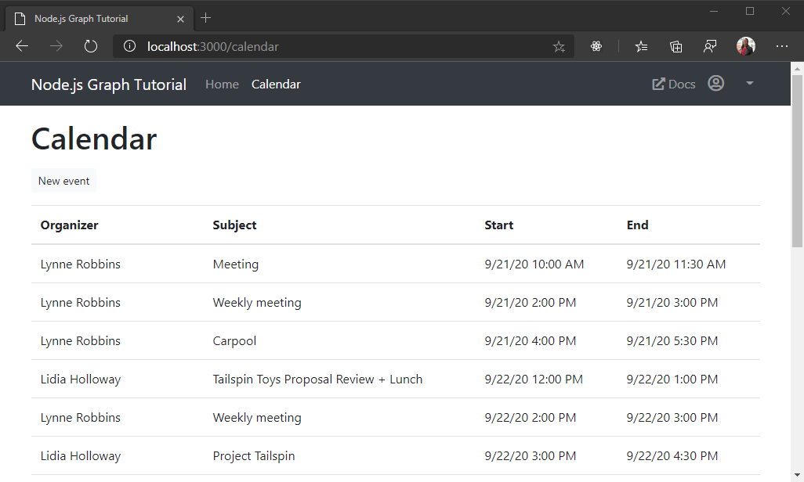

<!-- markdownlint-disable MD002 MD041 -->

<span data-ttu-id="9c01a-101">Dans cet exercice, vous allez incorporer Microsoft Graph dans l’application.</span><span class="sxs-lookup"><span data-stu-id="9c01a-101">In this exercise you will incorporate Microsoft Graph into the application.</span></span> <span data-ttu-id="9c01a-102">Pour cette application, vous allez utiliser la bibliothèque [Microsoft-Graph-client](https://github.com/microsoftgraph/msgraph-sdk-javascript) pour passer des appels à Microsoft Graph.</span><span class="sxs-lookup"><span data-stu-id="9c01a-102">For this application, you will use the [microsoft-graph-client](https://github.com/microsoftgraph/msgraph-sdk-javascript) library to make calls to Microsoft Graph.</span></span>

## <a name="get-calendar-events-from-outlook"></a><span data-ttu-id="9c01a-103">Récupérer les événements de calendrier à partir d’Outlook</span><span class="sxs-lookup"><span data-stu-id="9c01a-103">Get calendar events from Outlook</span></span>

1. <span data-ttu-id="9c01a-104">Ouvrez **./graph.js** et ajoutez la fonction suivante dans `module.exports` .</span><span class="sxs-lookup"><span data-stu-id="9c01a-104">Open **./graph.js** and add the following function inside `module.exports`.</span></span>

    :::code language="javascript" source="../demo/graph-tutorial/graph.js" id="GetCalendarViewSnippet":::

    <span data-ttu-id="9c01a-105">Que fait ce code ?</span><span class="sxs-lookup"><span data-stu-id="9c01a-105">Consider what this code is doing.</span></span>

    - <span data-ttu-id="9c01a-106">L’URL qui sera appelée est `/me/events`.</span><span class="sxs-lookup"><span data-stu-id="9c01a-106">The URL that will be called is `/me/events`.</span></span>
    - <span data-ttu-id="9c01a-107">La `select` méthode limite les champs renvoyés pour chaque événement à ceux que l’affichage utilise réellement.</span><span class="sxs-lookup"><span data-stu-id="9c01a-107">The `select` method limits the fields returned for each events to just those the view will actually use.</span></span>
    - <span data-ttu-id="9c01a-108">La `orderby` méthode trie les résultats en fonction de la date et de l’heure de leur création, avec l’élément le plus récent en premier.</span><span class="sxs-lookup"><span data-stu-id="9c01a-108">The `orderby` method sorts the results by the date and time they were created, with the most recent item being first.</span></span>

1. <span data-ttu-id="9c01a-109">Créez un fichier dans le répertoire **./routes** nommé **calendar.js** et ajoutez le code suivant.</span><span class="sxs-lookup"><span data-stu-id="9c01a-109">Create a new file in the **./routes** directory named **calendar.js** , and add the following code.</span></span>

    ```javascript
    const router = require('express-promise-router')();
    const graph = require('../graph.js');
    const moment = require('moment-timezone');
    const iana = require('windows-iana');
    const { body, validationResult } = require('express-validator');
    const validator = require('validator');

    /* GET /calendar */
    router.get('/',
      async function(req, res) {
        if (!req.session.userId) {
          // Redirect unauthenticated requests to home page
          res.redirect('/')
        } else {
          const params = {
            active: { calendar: true }
          };

          // Get the user
          const user = req.app.locals.users[req.session.userId];
          // Convert user's Windows time zone ("Pacific Standard Time")
          // to IANA format ("America/Los_Angeles")
          // Moment needs IANA format
          const timeZoneId = iana.findOneIana(user.timeZone);
          console.log(`Time zone: ${timeZoneId.valueOf()}`);

          // Calculate the start and end of the current week
          // Get midnight on the start of the current week in the user's timezone,
          // but in UTC. For example, for Pacific Standard Time, the time value would be
          // 07:00:00Z
          var startOfWeek = moment.tz(timeZoneId.valueOf()).startOf('week').utc();
          var endOfWeek = moment(startOfWeek).add(7, 'day');
          console.log(`Start: ${startOfWeek.format()}`);

          // Get the access token
          var accessToken;
          try {
            accessToken = await getAccessToken(req.session.userId, req.app.locals.msalClient);
          } catch (err) {
            res.send(JSON.stringify(err, Object.getOwnPropertyNames(err)));
            return;
          }

          if (accessToken && accessToken.length > 0) {
            try {
              // Get the events
              const events = await graph.getCalendarView(
                accessToken,
                startOfWeek.format(),
                endOfWeek.format(),
                user.timeZone);

              res.json(events.value);
            } catch (err) {
              res.send(JSON.stringify(err, Object.getOwnPropertyNames(err)));
            }
          }
          else {
            req.flash('error_msg', 'Could not get an access token');
          }
        }
      }
    );

    async function getAccessToken(userId, msalClient) {
      // Look up the user's account in the cache
      try {
        const accounts = await msalClient
          .getTokenCache()
          .getAllAccounts();

        const userAccount = accounts.find(a => a.homeAccountId === userId);

        // Get the token silently
        const response = await msalClient.acquireTokenSilent({
          scopes: process.env.OAUTH_SCOPES.split(','),
          redirectUri: process.env.OAUTH_REDIRECT_URI,
          account: userAccount
        });

        return response.accessToken;
      } catch (err) {
        console.log(JSON.stringify(err, Object.getOwnPropertyNames(err)));
      }
    }

    module.exports = router;
    ```

1. <span data-ttu-id="9c01a-110">Update **./app.js** pour utiliser ce nouvel itinéraire.</span><span class="sxs-lookup"><span data-stu-id="9c01a-110">Update **./app.js** to use this new route.</span></span> <span data-ttu-id="9c01a-111">Ajoutez la ligne suivante **avant** la `var app = express();` ligne.</span><span class="sxs-lookup"><span data-stu-id="9c01a-111">Add the following line **before** the `var app = express();` line.</span></span>

    ```javascript
    var calendarRouter = require('./routes/calendar');
    ```

1. <span data-ttu-id="9c01a-112">Ajoutez la ligne suivante **après** la `app.use('/auth', authRouter);` ligne.</span><span class="sxs-lookup"><span data-stu-id="9c01a-112">Add the following line **after** the `app.use('/auth', authRouter);` line.</span></span>

    ```javascript
    app.use('/calendar', calendarRouter);
    ```

1. <span data-ttu-id="9c01a-113">Redémarrez le serveur.</span><span class="sxs-lookup"><span data-stu-id="9c01a-113">Restart the server.</span></span> <span data-ttu-id="9c01a-114">Connectez-vous, puis cliquez sur le lien **calendrier** dans la barre de navigation.</span><span class="sxs-lookup"><span data-stu-id="9c01a-114">Sign in and click the **Calendar** link in the nav bar.</span></span> <span data-ttu-id="9c01a-115">Si tout fonctionne, vous devriez voir une image mémoire JSON des événements dans le calendrier de l’utilisateur.</span><span class="sxs-lookup"><span data-stu-id="9c01a-115">If everything works, you should see a JSON dump of events on the user's calendar.</span></span>

## <a name="display-the-results"></a><span data-ttu-id="9c01a-116">Afficher les résultats</span><span class="sxs-lookup"><span data-stu-id="9c01a-116">Display the results</span></span>

<span data-ttu-id="9c01a-117">Vous pouvez désormais ajouter une vue pour afficher les résultats de façon plus parlante.</span><span class="sxs-lookup"><span data-stu-id="9c01a-117">Now you can add a view to display the results in a more user-friendly manner.</span></span>

1. <span data-ttu-id="9c01a-118">Ajoutez le code suivant dans **./app.js après** la `app.set('view engine', 'hbs');` ligne.</span><span class="sxs-lookup"><span data-stu-id="9c01a-118">Add the following code in **./app.js after** the `app.set('view engine', 'hbs');` line.</span></span>

    :::code language="javascript" source="../demo/graph-tutorial/app.js" id="FormatDateSnippet":::

    <span data-ttu-id="9c01a-119">Cela implémente une [assistance de guidon](http://handlebarsjs.com/#helpers) pour mettre en forme la date ISO 8601 renvoyée par Microsoft Graph en une solution plus conviviale.</span><span class="sxs-lookup"><span data-stu-id="9c01a-119">This implements a [Handlebars helper](http://handlebarsjs.com/#helpers) to format the ISO 8601 date returned by Microsoft Graph into something more human-friendly.</span></span>

1. <span data-ttu-id="9c01a-120">Créez un fichier dans le répertoire **./views** nommé **Calendar. BH** et ajoutez le code suivant.</span><span class="sxs-lookup"><span data-stu-id="9c01a-120">Create a new file in the **./views** directory named **calendar.hbs** and add the following code.</span></span>

    :::code language="html" source="../demo/graph-tutorial/views/calendar.hbs" id="LayoutSnippet":::

    <span data-ttu-id="9c01a-121">Cela permet de parcourir une collection d’événements et d’ajouter une ligne de tableau pour chacun d’eux.</span><span class="sxs-lookup"><span data-stu-id="9c01a-121">That will loop through a collection of events and add a table row for each one.</span></span>

1. <span data-ttu-id="9c01a-122">À présent, mettez à jour l’itinéraire dans **./routes/calendar.js** pour utiliser cet affichage.</span><span class="sxs-lookup"><span data-stu-id="9c01a-122">Now update the route in **./routes/calendar.js** to use this view.</span></span> <span data-ttu-id="9c01a-123">Remplacez l’itinéraire existant par le code suivant.</span><span class="sxs-lookup"><span data-stu-id="9c01a-123">Replace the existing route with the following code.</span></span>

    :::code language="javascript" source="../demo/graph-tutorial/routes/calendar.js" id="GetRouteSnippet" highlight="33-36,49,51-54,61":::

1. <span data-ttu-id="9c01a-124">Enregistrez vos modifications, redémarrez le serveur et connectez-vous à l’application.</span><span class="sxs-lookup"><span data-stu-id="9c01a-124">Save your changes, restart the server, and sign in to the app.</span></span> <span data-ttu-id="9c01a-125">Cliquez sur le lien **calendrier** et l’application doit maintenant afficher un tableau d’événements.</span><span class="sxs-lookup"><span data-stu-id="9c01a-125">Click on the **Calendar** link and the app should now render a table of events.</span></span>

    
