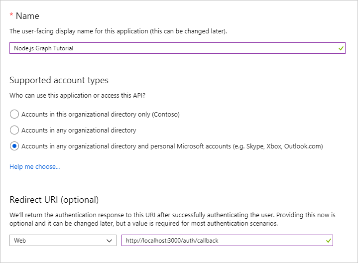

<!-- markdownlint-disable MD002 MD041 -->

Dans cet exercice, vous allez créer une inscription de l'application Web Azure AD à l'aide du centre d'administration Azure Active Directory.In this exercise, you will create a new Azure AD web application registration using the Azure Active Directory admin center.

1. Ouvrez un navigateur et accédez au [Centre d'administration Azure Active Directory](https://aad.portal.azure.com).Open a browser and navigate to the [Azure Active Directory admin center](https://aad.portal.azure.com). Connectez-vous à l'aide d'un compte **personnel** (alias Microsoft) ou **compte professionnel ou scolaire**.Login using a **personal account** (aka: Microsoft Account) or **Work or School Account**.

1. Sélectionnez **Azure Active Directory** dans le volet de navigation de gauche, puis sélectionnez **inscriptions des applications (aperçu)** sous **gérer**.Select **Azure Active Directory** in the left-hand navigation, then select **App registrations (Preview)** under **Manage**.

    

1. Sélectionnez **nouvelle inscription**.Select **New registration**. Sur la page **inscrire une application** , définissez les valeurs comme suit.On the **Register an application** page, set the values as follows.

    - Définissez **nom** sur `Node.js Graph Tutorial`.Set **Name** to `Node.js Graph Tutorial`.
    - Définissez les types de comptes **pris en charge** sur **les comptes de tous les comptes d'annuaire et de Microsoft personnels**.Set **Supported account types** to **Accounts in any organizational directory and personal Microsoft accounts**.
    - Sous **URI**de redirection, définissez la première liste déroulante sur `Web` et définissez la `http://localhost:3000/auth/callback`valeur sur.Under **Redirect URI**, set the first drop-down to `Web` and set the value to `http://localhost:3000/auth/callback`.

    

1. Sélectionnez **Enregistrer**.Choose **Register**. Sur la page **didacticiel de Graph node. js** , copiez la valeur de l' **ID d'application (client)** et enregistrez-la, vous en aurez besoin à l'étape suivante.On the **Node.js Graph Tutorial** page, copy the value of the **Application (client) ID** and save it, you will need it in the next step.

    

1. Sélectionnez **authentification** sous **gérer**.Select **Authentication** under **Manage**. Recherchez la section **Grant implicite** et activez les **jetons d'ID**.Locate the **Implicit grant** section and enable **ID tokens**. Cliquez sur **Enregistrer**.Choose **Save**.

    

1. Sélectionnez **certificats & secrets** sous **gérer**.Select **Certificates & secrets** under **Manage**. Sélectionnez le bouton **nouveau client secrète** .Select the **New client secret** button. Entrez une valeur dans **Description** , puis sélectionnez l'une des options \*\*\*\* pour expirer, puis choisissez **Ajouter**.Enter a value in **Description** and select one of the options for **Expires** and choose **Add**.

    

1. Copiez la valeur de la clé secrète client avant de quitter cette page.Copy the client secret value before you leave this page. Vous en aurez besoin à l'étape suivante.You will need it in the next step.

    > [!IMPORTANT]
    > Cette clé secrète client ne s'affiche plus, vérifiez que vous la copiez maintenant.This client secret is never shown again, so make sure you copy it now.

    